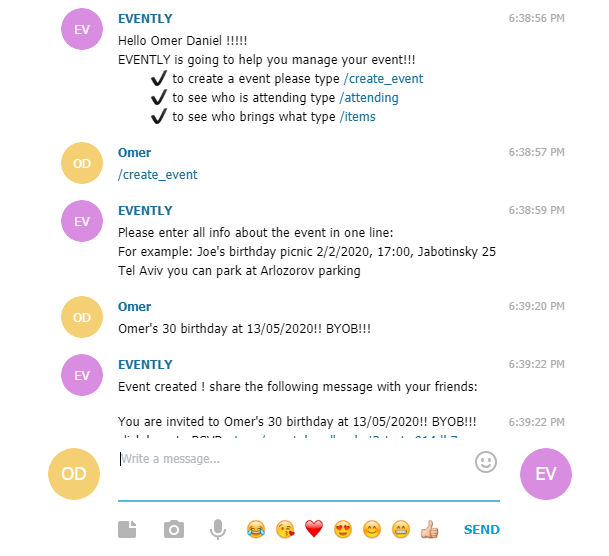
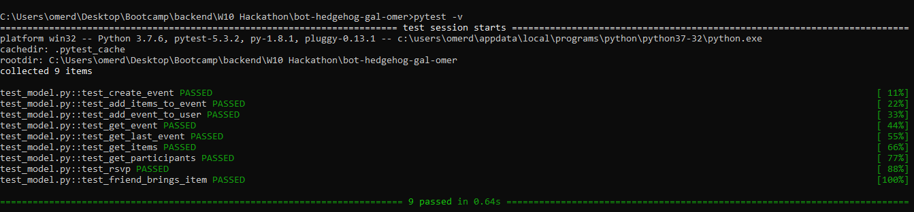

# Evently
<https://t.me/event_handler_bot>

Evently is going to help you manage your events!!!

* Omer Daniel
* Gal Hadad

you can create your event, ask your friends items to bring with them and let the bot ask your friends for ascendancy. 

## Screenshots

1. search for EVENTLY in the search bar 
2. enter the commend /create_event in order to create new event
3. give a description to your event --> your friend you see this description when they click the link
after you enter a description you will get a link--> this link is the invitation
4. if you would like that people will brings something now it the time to enter the stuff you need
(press enter after each item)
5. share the link (3) with your friend (the one you want to invite)
6. in order to get info who is coming (in other words, how many friends do you have):
enter the comment /attending

### Prerequisites
* Python 3.7 or 3.8
* pipenv
* {ADD MORE DEPENDENCIES HERE - FOR EXAMPLE MONGODB OR ANYTHING ELSE}

### Setup
* Clone this repo from github
* Install dependencies: `pipenv install`
* Get a BOT ID from the [botfather](https://telegram.me/BotFather).
* change `secrets.example` to `secrets.py` and edit your bot token provided by botfather

### Run
To run the bot use:

    pipenv run python bot.py

### Running tests
First make sure to install all dev dependencies:

    pipenv install --dev

To run all test  use:

    pipenv run pytest

(Or just `pytest` if running in a pipenv shell.)
Please make sure all tests are passing: 

## Credits and References
* [Telegram Docs](https://core.telegram.org/bots)
* [python-telegram-bot](https://github.com/python-telegram-bot/python-telegram-bot)
* [MongoDB docs](https://docs.mongodb.com/)
* [StackOverflow](https://stackoverflow.com/) 
* Udi, Yaniv and Eran
